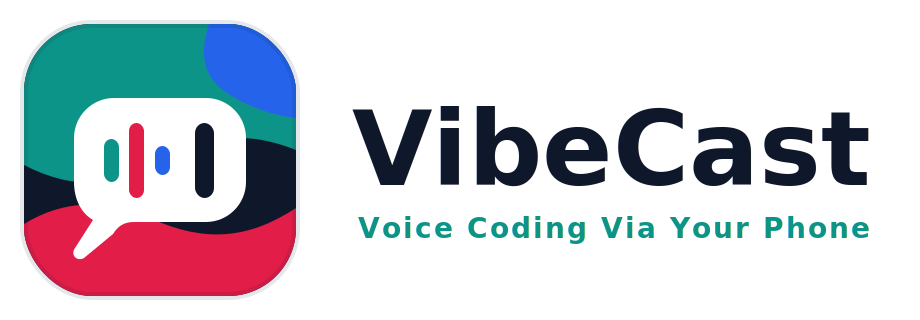
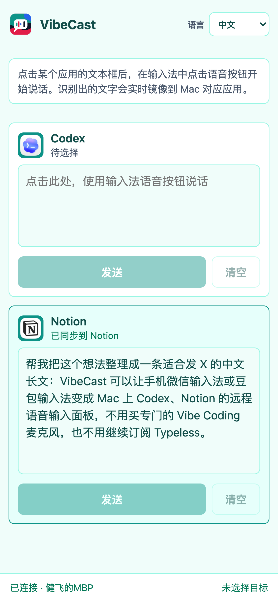
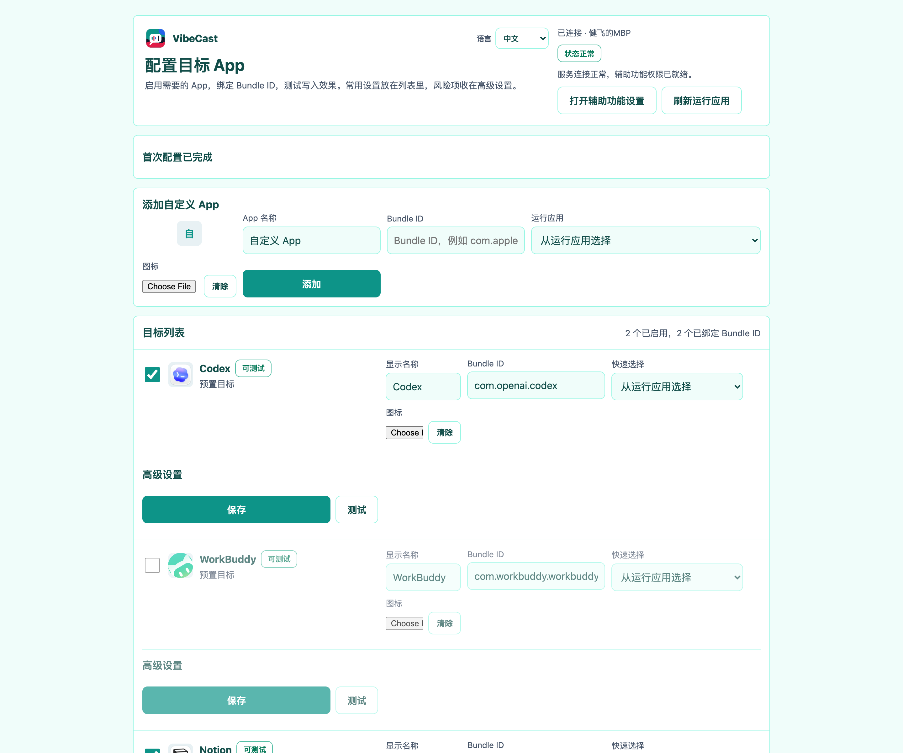
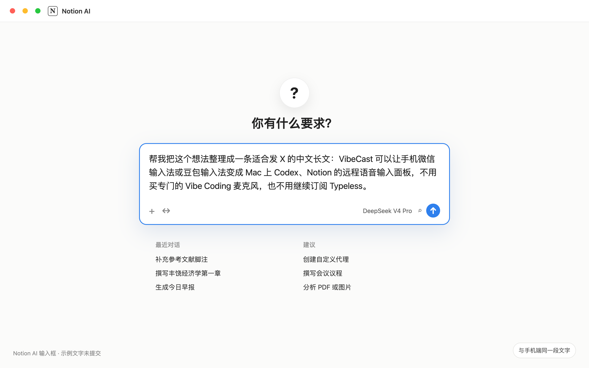

<p align="center">
  
</p>

<h1 align="center">VibeCast</h1>

<p align="center">
  把手机变成 macOS 的远程语音文本输入面板，专为 Vibe Coding 设计。
</p>

<p align="center">
  <a href="#vibecast">中文</a> ·
  <a href="docs/i18n/en/README.md">English</a> ·
  <a href="docs/i18n/ja/README.md">日本語</a> ·
  <a href="docs/i18n/ko/README.md">한국어</a> ·
  <a href="docs/i18n/es/README.md">Español</a> ·
  <a href="docs/i18n/hi/README.md">हिन्दी</a> ·
  <a href="docs/i18n/ar/README.md">العربية</a>
</p>

VibeCast 把手机变成 Mac 上的高效输入面板：手机负责用你熟悉的系统输入法或微信输入法完成语音转文字，Mac 负责把文本实时镜像到 Codex、WorkBuddy、Notion、Obsidian、CodeBuddyCN、CodeBuddy 或任意自定义目标应用，并在最终文本同步完成后执行发送。

它的体验很直接：拿起手机说话，在 Mac 上写入；在手机上修改，在 Mac 上同步；确认后发送，让 Vibe Coding 的输入节奏跟上你的思路。

## 界面截图

| 手机端输入面板 | 目标 App 配置页 |
|---|---|
|  |  |

<p align="center">
  
</p>

## 核心价值

| 能力 | 体验 |
|---|---|
| 手机即输入面板 | 手机浏览器打开 Mac 提供的页面即可使用，也可以添加到主屏幕 |
| 熟悉的语音输入 | 继续使用系统输入法、微信输入法或你喜欢的手机输入法 |
| 多目标草稿 | Codex / WorkBuddy / Notion / Obsidian / CodeBuddyCN / CodeBuddy 与自定义 App 拥有独立草稿和同步状态 |
| 实时文本镜像 | 手机文本通过 WebSocket 快照同步到 Mac 目标输入框 |
| 发送前确认 | VibeCast 等待最终 revision 写入成功，再执行 Enter、快捷键或仅同步动作 |
| 本地优先隐私 | 网页不请求麦克风权限，不传输音频，诊断日志不记录正文或令牌 |
| 可配置目标 | 配置 Bundle ID、聚焦方式、写入方式、发送方式和安全写入护栏 |
| 多语言体验 | 手机端、配置页、macOS 菜单和用户文档支持 7 种语言 |

## 输入模式

VibeCast 支持两类同步语义，可以按目标 App 的输入区域选择：

| 模式 | 适用场景 | 行为 |
|---|---|---|
| 对话框模式 | Codex、WorkBuddy、Notion AI、CodeBuddy 等单一输入框 | 手机草稿作为完整内容镜像到目标输入框，适合发送前反复修改整段提示词或消息 |
| 编辑器模式 | Obsidian、Notion 普通文档块、富文本编辑器 | 首次在当前光标位置插入，本轮后续同步只替换 VibeCast 插入的这一段，不会清空整个编辑器 |

Notion 默认保持对话框模式，适合 Notion AI。Obsidian 作为预置目标默认启用编辑器模式：先在 Mac 端把光标放到目标笔记位置，再用手机输入；点击“完成”后，Mac 端文本保留，手机端本轮输入清空。

## 相比连续麦克风

与 iPhone/Mac 连续麦克风功能相比，本项目解决了：

1. 连续麦克风连接不稳定。
2. iPhone 在连续麦克风状态下不能有其他操作。
3. 不能快速切换 Mac 端的目标 App。
4. 连续麦克风本质需先唤醒 Mac 端语音输入法，手不能离开键盘。
5. 连续麦克风不支持 Android 机。

## 快速上手指南

1. 在 Mac 上启动 VibeCast，菜单栏出现 VibeCast 图标。
2. 选择复制访问地址。
3. 在同 WiFi 的手机浏览器中打开该地址。
4. 在手机页面选择 Codex、Notion 或任意已配置目标。
5. 用手机输入法或语音输入，文本实时出现在 Mac 端对应 App。
6. 点击“发送”，VibeCast 确认最终文本已同步后执行目标应用发送动作。

## 系统要求

- macOS 13 Ventura 及以上
- Xcode Command Line Tools，Swift 5.9+
- Node.js 18+
- 手机浏览器
- Mac 和手机可互相访问的本地网络
- macOS 辅助功能权限，用于激活应用、聚焦输入框、写入文本和发送

## 本地构建

```bash
# 构建手机端页面，产物进入 Mac App 资源目录
cd web
npm install
npm run build

# 打包 macOS 菜单栏 App
cd ..
bash scripts/build_app.sh

# 启动
open dist/VibeCast.app
```

首次启动后：

1. 在 macOS 系统设置里授予 VibeCast 辅助功能权限。
2. 菜单栏点击“打开配置页面…”，启用需要的目标或添加自定义 App。
3. 为目标配置 Bundle ID、聚焦策略、写入方式和发送方式。
4. 菜单栏点击“复制访问地址（含令牌）”，用手机浏览器打开。

如果 npm 受到本机 preload 环境影响并报 `genie-safe-delete` 相关错误，使用 `NODE_OPTIONS=""` 清空该环境变量。

## 开发与测试

```bash
# Web
cd web
NODE_OPTIONS="" npm test
NODE_OPTIONS="" npm run typecheck
NODE_OPTIONS="" npm run build

# Mac
cd mac
swift test
swift build
```

## 项目结构

```text
VibeCast/
├── mac/                    # Swift 菜单栏服务、HTTP/WS、Accessibility、配置、诊断
├── web/                    # 手机端页面与配置页，TypeScript + Vite
├── shared/protocol.md      # WebSocket 同步协议对齐来源
├── docs/                   # 中文用户文档
├── docs/i18n/              # English / 日本語 / 한국어 / Español / हिन्दी / العربية
├── brand/                  # Logo、App Icon、菜单栏图标
└── scripts/                # 构建脚本
```

## 文档

- [安装与使用](docs/INSTALL.md)
- [目标应用配置](docs/CONFIGURATION.md)
- [架构说明](docs/ARCHITECTURE.md)
- [安全与隐私](docs/SECURITY.md)
- [排障指南](docs/TROUBLESHOOTING.md)
- [能力边界与最佳实践](docs/KNOWN_LIMITS.md)
- [卸载](docs/UNINSTALL.md)
- [同步协议](shared/protocol.md)

## 安全与隐私

VibeCast 专注文本流。语音识别发生在手机输入法内部，VibeCast 网页只接收输入法写入的文字：

- 网页不请求麦克风权限。
- VibeCast 不接收、传输或保存音频。
- Mac 端不把用户文本发送给外部服务。
- 文本同步通过 Mac 本机服务完成。
- 配对令牌保护 WebSocket 连接。
- 诊断日志只记录事件、目标、revision、文本长度和短哈希。

完整说明见 [安全与隐私](docs/SECURITY.md)。

## 致谢

产品、设计、编码、营销：All by Codex。感谢 OpenAI。

## License

VibeCast is released under the [MIT License](LICENSE).
