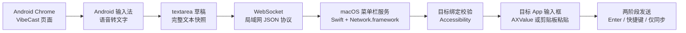

# VibeCast

把 Android 手机变成 macOS 的远程语音文本输入面板。

VibeCast 不做语音识别，也不传输音频。它在 Mac 上启动一个局域网服务，Android 手机用浏览器打开页面后，可以使用系统输入法或微信输入法把语音识别成文字；Mac 端负责把这段文字实时镜像到 Codex、WorkBuddy、Notion、CodeBuddy 等目标应用，并在确认最终文本已同步后执行发送。

> 当前项目面向单用户、同一局域网、本地设备工作流。公网远程控制、多用户协作、云端语音识别都不是 v1 目标。

## 核心能力

| 能力 | 说明 |
|---|---|
| 手机端免安装 | Android Chrome 打开 Mac 提供的局域网页即可使用，可添加到主屏幕 |
| 输入法语音 | 语音识别由 Android 默认输入法完成，网页只使用标准 `<textarea>` |
| 四目标草稿 | Codex / WorkBuddy / Notion / CodeBuddy 独立草稿、独立 revision |
| 实时镜像 | 手机文本以完整快照通过 WebSocket 同步到 Mac 目标输入框 |
| 两阶段发送 | 发送前确认最终 revision 已写入，再执行目标应用发送动作 |
| 安全护栏 | 写入和发送前校验目标绑定，日志脱敏，不记录完整文本或令牌 |
| 本地配置 | 菜单栏打开配置页，启用预置目标或添加自定义 App，选择 Bundle ID、聚焦方式、写入方式和发送方式 |

## 工作流



日常使用时：

1. Mac 启动 VibeCast，菜单栏出现 `VC`。
2. 手机打开菜单栏复制的访问地址。
3. 点击某个目标应用卡片的文本框。
4. Mac 激活并聚焦对应应用输入框。
5. 在 Android 输入法里点击语音按钮说话。
6. 手机识别出的文字实时同步到 Mac。
7. 点击手机上的“发送”，Mac 确认最终文本已同步后执行发送。

## 系统要求

- macOS 13 Ventura 及以上
- Xcode Command Line Tools，Swift 5.9+
- Node.js 18+
- Android Chrome
- Mac 和 Android 手机在同一局域网
- macOS 辅助功能权限，用于激活应用、聚焦输入框、写入文本和发送

## 快速开始

```bash
# 构建手机端页面，产物进入 Mac App 资源目录
cd web
npm install
npm run build

# 打包 macOS 菜单栏 App
cd ..
bash scripts/build_app.sh

# 启动
open dist/VibeCast.app
```

首次启动后：

1. 在 macOS 系统设置里授予 VibeCast 辅助功能权限。
2. 菜单栏点击“打开配置页面…”，启用需要的目标或添加自定义 App，并配置 Bundle ID、聚焦策略和发送方式。
3. 菜单栏点击“复制访问地址（含令牌）”，用 Android Chrome 打开。

更完整的安装步骤见 [安装与使用](docs/INSTALL.md)。

## 开发与测试

```bash
# Web
cd web
NODE_OPTIONS="" npm test
NODE_OPTIONS="" npm run build

# Mac
cd mac
swift test
swift build
```

> 如果 npm 受到本机 preload 环境影响并报 `genie-safe-delete` 相关错误，使用 `NODE_OPTIONS=""` 清空该环境变量。

## 项目结构

```text
VibeCast/
├── mac/                    # Swift 菜单栏服务、HTTP/WS、Accessibility、配置、诊断
├── web/                    # Android 手机端页面与配置页，TypeScript + Vite
├── shared/protocol.md      # WebSocket 同步协议唯一对齐来源
├── docs/                   # 对外安装、配置、架构、安全、排障、卸载文档
├── PRD.md                  # 产品设计历史资料
└── DEVELOPMENT_PLAN.md     # 开发计划历史资料
```

## 文档

- [安装与使用](docs/INSTALL.md)
- [目标应用配置](docs/CONFIGURATION.md)
- [架构说明](docs/ARCHITECTURE.md)
- [安全与隐私](docs/SECURITY.md)
- [排障指南](docs/TROUBLESHOOTING.md)
- [已知限制](docs/KNOWN_LIMITS.md)
- [卸载](docs/UNINSTALL.md)
- [同步协议](shared/protocol.md)

## 安全与隐私边界

VibeCast 的设计边界很明确：

- 不在 Mac 做语音识别。
- 网页不请求麦克风权限。
- 不接收、传输或保存音频。
- 不把用户文本发送给外部服务。
- 文本同步只在局域网内通过 Mac 本机服务完成。
- 诊断日志只记录事件、目标、revision、文本长度和短哈希，不记录全文、令牌或剪贴板内容。

当前 MVP 使用 URL 内长期配对令牌。请只在可信局域网中使用，不要把含 token 的访问地址发给他人。更多细节见 [安全与隐私](docs/SECURITY.md)。

## 当前状态

项目已实现核心链路：Web 草稿、WebSocket 协议、Mac 菜单栏服务、目标配置、辅助功能聚焦、文本镜像、两阶段发送、脱敏诊断和测试覆盖。

0.1 按“通用可配置目标”发布，不承诺第三方应用特定版本适配。正式使用前，请先用配置页里的“测试”确认写入范围，尤其是 Notion、Electron/WebView、自定义 App 和自定义快捷键场景。

发布前检查见 [0.1 发布检查清单](docs/RELEASE_0_1_CHECKLIST.md)。
