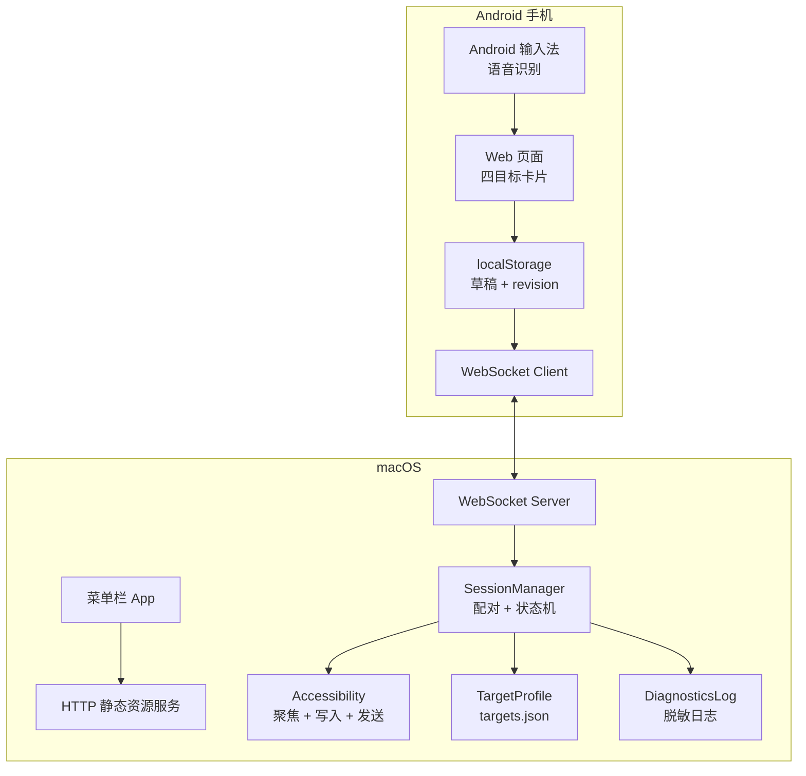

# 架构说明

VibeCast 由 macOS Swift 服务和 Android Web 前端组成。两端通过局域网 WebSocket 交换 JSON 消息，协议定义见 [`../shared/protocol.md`](../shared/protocol.md)。

## 总览



## Mac 服务

Mac 端是 Swift 原生菜单栏 App：

- `AppDelegate` 负责菜单栏 UI、服务生命周期、访问地址复制、配置页入口、日志导出、登录项开关。
- `Server` 基于 `Network.framework` 监听 TCP，处理 HTTP 静态资源和 WebSocket 连接。
- `SessionManager` 负责协议分发、配对令牌校验、单一活动会话、目标绑定、revision 门控和发送幂等。
- `FocusController` 负责激活目标应用、执行聚焦策略、读取并校验当前可编辑 Accessibility 元素。
- `TextWriter` 负责完整文本写入，优先 AXValue，必要时走剪贴板粘贴。
- `SendAction` 负责按目标 Profile 执行 Enter、自定义快捷键、Accessibility 按钮或仅同步。
- `TargetConfigStore` 将四个目标 Profile 持久化到 `~/Library/Application Support/VibeCast/targets.json`。

## Web 前端

手机端是 TypeScript + Vite + 原生 DOM：

- `App` 串联草稿、输入法事件、WebSocket 和 UI 卡片。
- `DraftStore` 为四个目标维护独立草稿、revision、acked revision 和光标位置。
- `IMEController` 监听 `composition*`、`input`、`selectionchange`，普通输入防抖，组合输入节流，发送前强制 flush。
- `WSClient` 负责 hello 握手、心跳、断线重连和消息分发。
- `config.ts` 提供配置页，通过 WebSocket 读取/保存 Profile、列出运行应用、测试目标。

## 同步模型

手机端文本是一次输入会话的事实源。每次文本变化都会形成完整快照：

```json
{
  "type": "text_snapshot",
  "sessionId": "session-uuid",
  "targetId": "codex",
  "revision": 23,
  "text": "完整文本",
  "selectionStart": 4,
  "selectionEnd": 4,
  "isComposing": false
}
```

Mac 端只应用比当前已应用版本更高的 revision。旧包会被丢弃并返回 `STALE_REVISION`。

## 目标绑定

选择目标时，手机发送 `select_target`。Mac 端会：

1. 校验辅助功能权限。
2. 按 Bundle ID 激活目标应用。
3. 执行配置的聚焦策略。
4. 获取当前可编辑 AX 元素。
5. 建立包含 target、session、pid、bundleId、AX element 的绑定。

后续写入和发送前都要重新校验绑定。校验失败时，Mac 会拒绝写入或发送，并向手机返回目标失焦状态。

## 文本写入

VibeCast 不逐字模拟键盘。写入策略来自目标 Profile：

- `auto`：优先 AXValue 直写，验证成功后完成；失败时按 `allowSelectAllReplace` 决定是否剪贴板写入。
- `axvalue`：只允许 AXValue，失败即拒绝。
- `clipboard_paste`：重新激活目标，在已聚焦输入框内全选并粘贴，适合 Electron/contenteditable。

剪贴板写入会备份并恢复系统剪贴板。写入空文本时使用 Delete 清除选中内容。

## 两阶段发送

发送流程分两阶段：

1. 手机在点击发送前立即 flush 最新快照。
2. Mac 检查该 revision 是否已经成功写入。
3. Mac 重新校验目标绑定。
4. Mac 执行发送动作。
5. Mac 返回 `send_result`。

同一个 `sessionId + targetId + revision` 的发送动作只提交一次。

## 配置与诊断

配置页同样由 Mac 托管，通过 WebSocket 使用 `get_config`、`set_config`、`list_running_apps`、`test_target` 消息。

诊断日志只记录脱敏事件。文本以长度和短哈希表示，令牌会被兜底脱敏。
