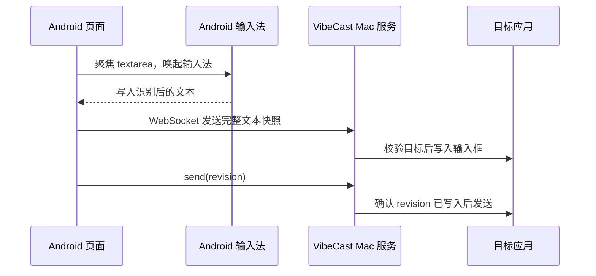

# 安全与隐私

VibeCast 的目标是让本地设备之间同步文本，而不是做远程控制或云端语音服务。

## 不做什么

- 不在 Mac 上做语音识别。
- 不请求网页麦克风权限。
- 不接收、传输或保存音频。
- 不调用 Whisper、Android SpeechRecognizer 或第三方语音识别 API。
- 不把用户文本发送给外部服务。
- 不做公网远程控制或多用户协作。

## 数据流

音频只存在于 Android 输入法自身的语音输入流程中，VibeCast 不接触音频。

## 配对令牌

当前 MVP 使用长期配对令牌：

- 令牌由 Mac 首次启动时生成，保存在 UserDefaults。
- 菜单栏复制的访问地址包含 `token=...`。
- 手机首次访问后会把令牌保存在 localStorage。
- 菜单栏可以重新生成令牌，旧地址会失效。

请不要把含 token 的访问地址发送给他人，也不要在不可信网络中使用。

## 局域网边界

VibeCast 默认监听本机端口 `8787`，用于同一局域网访问。它不会主动做公网穿透，但实际可见范围取决于你的网络、路由器和防火墙设置。

建议：

- 只在可信家庭或办公局域网中使用。
- 不要通过端口转发暴露到公网。
- 使用完成后可退出菜单栏 App。
- 丢失访问地址或怀疑泄露时，重新生成配对令牌。

## 文本写入护栏

VibeCast 写入文本前会校验目标绑定：

- 目标来自明确的 `select_target`。
- 目标应用 Bundle ID 和进程仍然匹配。
- 当前绑定的可编辑元素仍然有效，或在剪贴板写入模式下目标进程仍然存在。
- 校验失败时拒绝写入和发送。

VibeCast 不使用逐字键盘模拟进行同步。写入采用 AXValue 或剪贴板粘贴，剪贴板内容会尽力备份和恢复。

## 诊断日志

诊断日志用于排障，默认不记录敏感正文：

- 不记录完整文本。
- 不记录配对令牌。
- 不记录剪贴板内容。
- 不记录音频。
- 文本只记录长度和短哈希。

导出的诊断包同样使用脱敏日志。

## 当前限制

当前版本没有 HTTPS、一次性二维码配对、多设备权限管理或公网访问安全模型。这些能力属于后续增强方向，不应把当前 MVP 当作互联网暴露服务使用。
