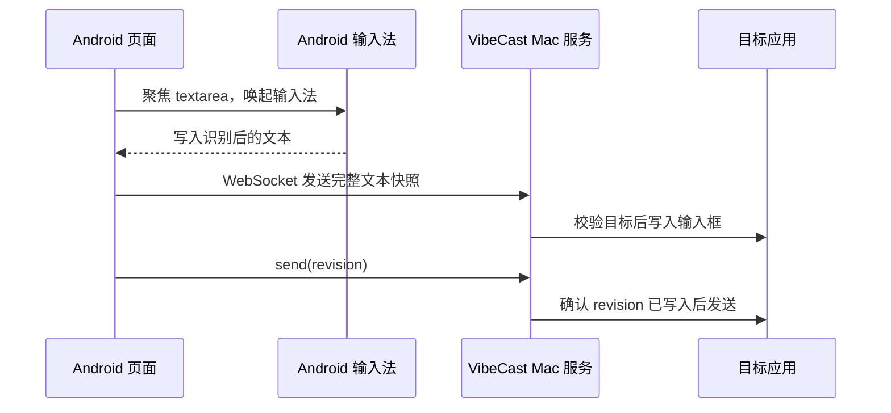

# 安全与隐私

VibeCast 专注本地文本流：手机输入法生成文字，Mac 菜单栏服务把文字写入你选择的目标应用。音频停留在输入法自己的语音输入流程中，VibeCast 处理的是文本。

## 隐私模型

- 网页使用标准 `<textarea>`，不请求麦克风权限。
- VibeCast 不接收、传输或保存音频。
- Mac 端不运行语音识别模型，也不调用第三方语音识别 API。
- 用户文本不会被发送到外部服务。
- 诊断日志只记录事件、目标、revision、文本长度和短哈希。

## 数据流

## 配对令牌

- 令牌由 Mac 首次启动时生成，保存在 UserDefaults。
- 菜单栏复制的访问地址包含 `token=...`。
- 手机首次访问后会把令牌保存在 localStorage。
- 菜单栏可以重新生成令牌，旧地址随即失效。
- 重新生成令牌后，当前已配对页面会被断开，需要使用新地址重新连接。

请把含 token 的访问地址当作本地控制入口管理：只分享给自己的设备，在可信网络中使用。

## 本地网络边界

VibeCast 默认监听端口 `8787`，供本地网络中的手机访问。实际可见范围取决于你的网络、路由器和防火墙设置。

建议：

- 在可信家庭或办公网络中使用。
- 不通过端口转发暴露服务。
- 使用完成后可退出菜单栏 App。
- 丢失访问地址或怀疑泄露时，重新生成配对令牌。

## 文本写入护栏

VibeCast 写入文本前会校验目标绑定：

- 目标来自明确的 `select_target`。
- 目标应用 Bundle ID 和进程仍然匹配。
- 当前绑定的可编辑元素仍然有效，或在剪贴板写入模式下目标进程仍然存在。
- 校验失败时拒绝写入和发送。
- 非当前活动控制端、未配对连接、sessionId 与当前绑定不一致的消息都会被拒绝。
- 单连接消息频率和消息大小受限，异常客户端会收到 `RATE_LIMITED` 或被断开。

VibeCast 使用 AXValue 或剪贴板粘贴进行完整文本镜像，不逐字模拟键盘。剪贴板写入会备份并恢复系统剪贴板。任何会触发 Cmd+A 全选替换的写入模式都必须显式启用 `allowSelectAllReplace`。

## 诊断日志

诊断日志默认脱敏：

- 不记录完整文本。
- 不记录配对令牌。
- 不记录剪贴板内容。
- 不记录音频。
- 文本只记录长度和短哈希。

导出的诊断包同样使用脱敏日志。
