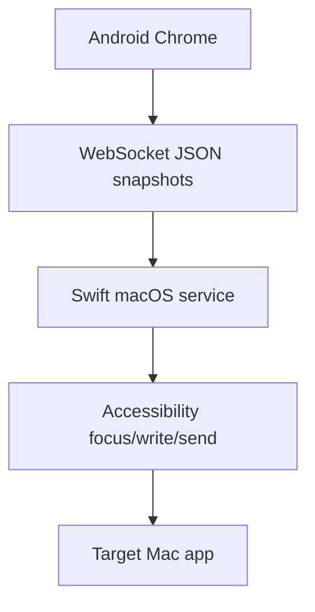

# المعمارية

يجمع VibeCast بين خدمة Swift في شريط قوائم macOS وتطبيق ويب TypeScript للهاتف.

يستضيف Mac موارد الويب، يقبل WebSocket، يتحقق من الاقتران والأهداف، يكتب عبر Accessibility وينفذ الإرسال. يعرض تطبيق الويب البطاقات ويحفظ المسودات ويتعامل مع IME composition ويرسل snapshots كاملة.

نص الهاتف هو مصدر الحقيقة لجلسة الإدخال. كل تغيير يحمل `targetId` و`sessionId` و`revision` والنص والتحديد.
