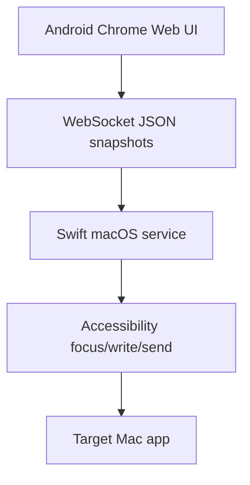

# Architecture

VibeCast has two parts: a native Swift menu bar service on macOS and a TypeScript web app on the phone.

## Mac Service

- Hosts static web resources over HTTP.
- Accepts WebSocket connections.
- Validates pairing tokens, sessions, targets, revisions, and text limits.
- Activates target apps and focuses configured inputs.
- Writes complete text snapshots with AXValue or clipboard modes.
- Executes send actions only after the requested revision is mirrored.

## Web App

- Renders target cards dynamically from Mac configuration.
- Stores independent drafts and revisions in localStorage.
- Handles IME composition events and selection changes.
- Sends complete snapshots, not character-level patches.
- Reconnects by sending the latest current state.

## Data Model

The phone is the source of truth for an input session. Each text change becomes a complete snapshot with `targetId`, `sessionId`, `revision`, text, selection, and composition state.
