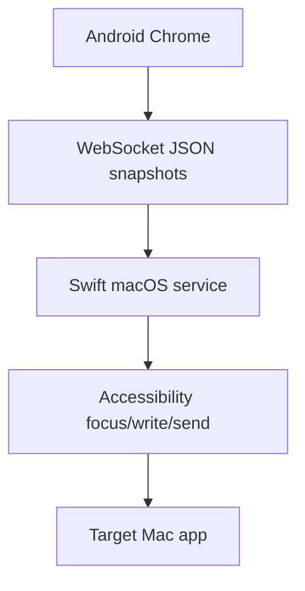

# Arquitectura

VibeCast combina un servicio Swift de barra de menús en macOS con una web TypeScript para el teléfono.

El Mac sirve recursos web, acepta WebSocket, valida emparejamiento y destinos, escribe mediante Accessibility y ejecuta envíos. La web renderiza tarjetas, guarda borradores, procesa eventos IME y envía snapshots completos.

El texto del teléfono es la fuente de verdad de la sesión. Cada cambio incluye `targetId`, `sessionId`, `revision`, texto y selección.
