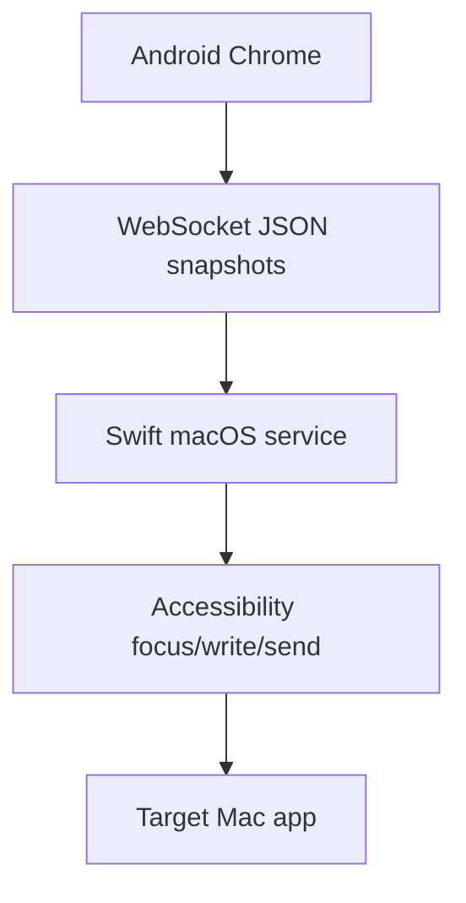

# Architecture

VibeCast में macOS Swift menu bar service और phone के लिए TypeScript web app है।

Mac web resources host करता है, WebSocket accept करता है, pairing और target validate करता है, Accessibility से लिखता है और send action चलाता है। Web app target cards, drafts, IME composition और full snapshot sync संभालता है।

Phone text input session का source of truth है। हर change में `targetId`, `sessionId`, `revision`, text और selection शामिल होते हैं।
