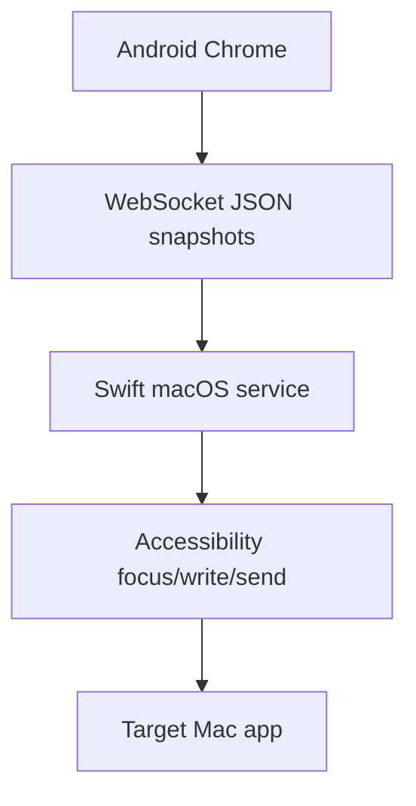

# アーキテクチャ

VibeCast は macOS Swift メニューバーサービスと TypeScript Web UI で構成されます。

Mac 側は Web リソース配信、WebSocket、配対、対象検証、Accessibility 書き込み、送信動作を担当します。Web 側は対象カード、下書き、IME composition、完全スナップショット同期、再接続を担当します。

スマホのテキストが入力セッションの真実源です。各変更は `targetId`、`sessionId`、`revision`、本文、選択範囲を持つ完全スナップショットになります。
