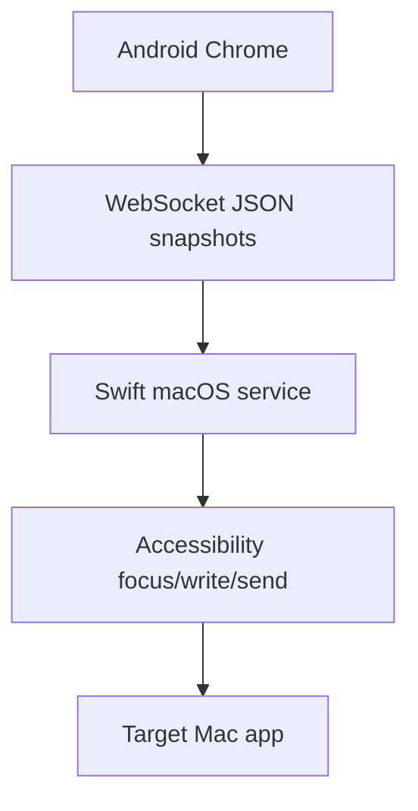

# 아키텍처

VibeCast는 macOS Swift 메뉴 막대 서비스와 TypeScript 웹 앱으로 구성됩니다.

Mac은 웹 리소스 호스팅, WebSocket, 페어링, 대상 검증, Accessibility 쓰기와 전송을 담당합니다. 웹 앱은 대상 카드, 초안, IME composition, 전체 스냅샷 동기화와 재연결을 담당합니다.

폰 텍스트가 입력 세션의 기준입니다. 각 변경은 `targetId`, `sessionId`, `revision`, 텍스트와 선택 범위를 포함한 전체 스냅샷입니다.
